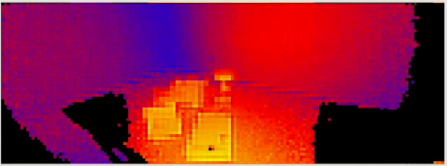
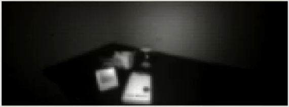
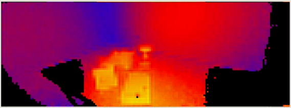

# The New 'CygLiDAR D2' Released
Frame Rate more improvement than D1 by **20 FPS**
Implement the **Amplitude Image** data
New 3D Data Filtering Added **(Kalman / Median / Average / Edge Filtering)**
Each Measurement(2D/3D) payload data provide **TimeStamp/Temperature**

# cyglidar_d2(ROS2)
cyglidar_d2 is a ROS package, which is designed to visualize 2D/3D distance dataset in real-time.

For more details in CygLiDAR, please visit http://www.cygbot.com

## How to use this package

### Preparation
```bash
mkdir -p ~/d2_ws/src/
cd ~/d2_ws/src/
git clone -b ROS2 https://github.com/CygLiDAR-ROS/cyglidar_d2.git
cd ..
colcon build --symlink-install
source install/setup.bash
```

* When CMake Error Occured as below
>pcl_conversionsConfig.cmake / pcl_conversions-config.cmake

```bash
sudo apt install ros-${ROS2 Distro}-pcl-conversions
# ex) sudo apt install ros-foxy-pcl-conversions
```

### Installation Udev
Install the udev rule
```bash
cd ~/cyglidar_ws/src/cyglidar_d1/scripts
chmod +x create_udev_rules.sh
./create_udev_rules.sh
```

### Run cyglidar_d2_publisher and View in the Rviz
```bash
ros2 launch cyglidar_d1_ros2 cyglidar.launch.py
ros2 launch cyglidar_d1_ros2 view_cyglidar.launch.py  (Run with Rviz)
```

#1 When CyglidarNode Error Occured
>[Error] : An exception was thrown [open : Permission denied]
Please check 'Installation Udev' Or use following command.
```bash
sudo chmod 777 /dev/ttyUSB0
```

### ROS2 Launch Parameter
#### Frame ID
```bash
/laser_frame
```

#### Fixed Frame
```bash
/map
```

#### CygLiDAR Topic List
```bash
/scan       (LaserScan)
/scan_2D    (PointCloud XYZRGBA)
/scan_3D    (PointCloud XYZRGBA)
/scan_image (Image)
```

#### Depth Image / Amplitude Image
From CygLiDAR D2, Provide Amplitude Data as well as Depth Data
* Depth Image
<h1 align="left">
  
</h1>

* Amplitude Image
<h1 align="left">
  
</h1>

#### None / Median / Average / Edge Filter
* None Filtering Depth Image
<h1 align="left">
  
</h1>

* Median Filtering Depth Image
<h1 align="left">
  
</h1>

* Average Filtering Depth Image
<h1 align="left">
  
</h1>

#### Raw Amplitude Image & CLAHE applied Amplitude Image
In case of grayscale, CALHE(Contrast Limited Adaptive Histogram Equalization) algorithm can be used to improve image contrast.

 | 

